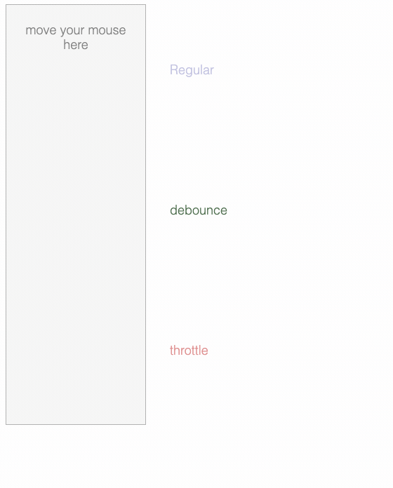

节流防抖
===



#### 节流(throttle)
一段时间内时间,单位时间内只会触发一次这个事件，属于降频；

适用场景：拖拽，滚动事件

实现：

```
function throttle(fn, time) {
    let flag = false
    return (params) => {
        if(flag) return;
        flag = true;
        setTimeout(() => {
            fn(params);
            flag = false;
        }, time)
    }
}
```

### 防抖（debounce）
一段时间内时间,只会触发一次这个事件，多余得点击会推迟这个事件的执行

适用场景：表单验证、多次点击防止重复提交

```
function debounce(fn, time) {
    let id = null;
    return (params)=>{
        if(id) clearTimeout(id);
        id = setTimeout(()=>{
            fn(params)
        }, time)
    }
}
```

