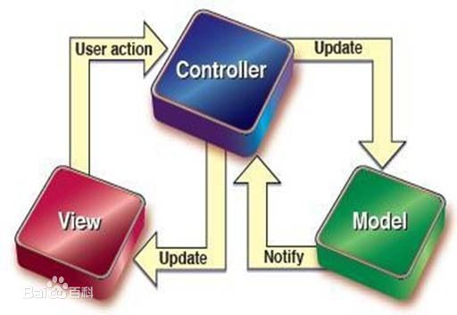

# MVC MVVM

  _前言：本篇文章并不适合初学者阅读，MVC(Model-View-Controller)与MVVM（Model-View-ViewModel）都是一种软件设计模式。没有实际项目经验的人看了也不会理解很深。_
  
-----------------------------------------------------------
我们可以思考下当页面种一个url输入后到页面展示得简单过程

> 页面url输入==>浏览器向后台service发送请求==>后台服务操作数据库==>计算数据结果返回==>页面读取响应结果展示

根据这个过程我们可以大体上将程序软件分为几个层级

* Model-> 数据层
* controller -> 后台逻辑控制层
* view -> 视图层

介入用户得操做就是如下

学java得人都知道 java的初级项目一个个都是mvc的典型，项目目录分的清清楚楚，做多了就会明白mvc模型缺点优点都很明显，优点就是快，小项目开发起来结构清晰。缺点就是业务逻辑代码不容易拆分，要么就是view层太重，一页代码上千行，要么就是controller层和业务逻辑绑定的太厉害，每次需求变更改动的代码量巨大

以上问题其实并没有什么良好的解决方案，需求变化及增加还是会导致大量的改动。直到mvvm模式的出现

MVVM将这个层级分成了这样
  
* Model-> 数据层
* View ->视图层
* ViewModel -> 视图模型层

从个人的角度来说，modal层和VM层其实中间也是存在controller层的。甚至随着业务复杂度上升中间还会掺杂着基于node的数据中台，做进一步的数据加工处理

MVVM中  V层和VM层进行着双向数据绑定的关系，这种手段被广泛应用于react、angluar以及vue中。尤其是使用redux mobox vuex 这种分层关系就会显而易见的显示出来。

这么做的优势特别明显就是前后台分离的比较明显，提高大型项目工作效率。后台处理的业务逻辑更少，更关注性能上的提高而非业务逻辑。甚至对于一些项目后台管理项目controller层被弱化到只起到了查询数据库表的作用。再复杂一点的也可以将业务逻辑扔到node中台，再保证前端少请求的同时，将几乎全部业务逻辑交给前端人员统一处理，方便管理业务及扩展

