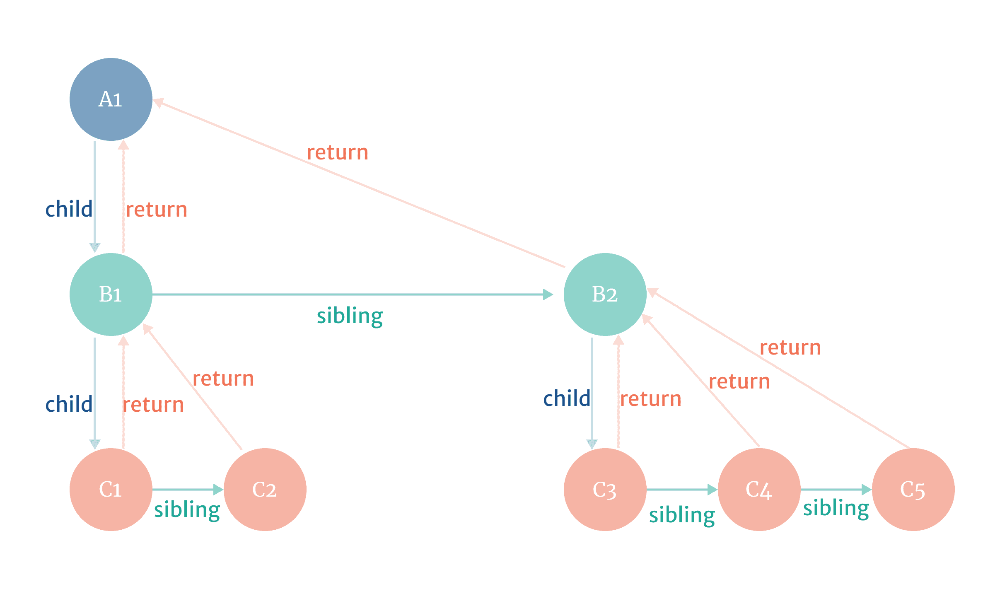

React Fiber
===

Fiber 架构主要是为了解决处理非常庞大的渲染工作时，UI 上能感知到的掉帧卡顿现象，而出现。

浏览器为什么会出现掉帧

上面提到 DOM 树庞大到一定程度更新时会出现掉帧，那一定程度是多少程度？一般来说，按浏览器每秒刷新 60 次来算（即所谓的 60 FPS），当页面需要连续渲染，却在下一个 16ms 内没有渲染的情况下，就会出现掉帧的现象。也就是说，如果浏览器假如有计算执行任务阻塞了浏览器渲染，且阻塞时间超过 16ms ，就会出现卡顿掉帧被人眼所感知到。
我们都知道，JS 是单线程的，在默认情况下，JS 运算、页面绘制渲染都是运行在浏览器的主线程当中，它们之间是互斥的关系，即任何时候只能有一个占用主线程。如果 JS 运算长时间持续占用主线程，页面就没法得到及时的更新。如 1.1.1）stack reconciler 不能中途被打断 所示，只要 stack reconciler 持续使用主线程的时间，超过 16ms，页面绘制渲染就没法获得控制权，就容易出现渲染掉帧的现象。

在Fiber 中，会把一个耗时很长的任务分成很多小的任务片，每一个任务片的运行时间很短。虽然总的任务执行时间依然很长，但是在每个任务小片执行完之后，都会给其他任务一个执行机会。这样，唯一的线程就不会被独占，其他任务也能够得到执行机会。

事实上，Fiber 在设计出来后，就是需要能让 React 完成以下最主要目标：

pause work and come back to it later（暂停工作，并且能之后回到暂停的地方）
assign priority to different types of work（安排不同类型工作的优先级）
reuse previously completed work（之前已经处理完的工作单元，可以得到重用）
abort work if it’s no longer needed（如果后续的工作不再需要做，工作可以直接被终止）


我们回到 React 设计的元概念上：

ui = f(data)
即：渲染一个 React App，其本质上就是在调用一个函数，只不过这个函数还会调用其里面的其他函数，形成调用栈。

JS 引擎自身的函数调用栈，我们无法控制，只能一条路走到黑。


Fiber 的数据结构
``` 关键字段
{
  type,
  key,
  child,
  sibling,
  return,
  pendingProps,
  memoizedProps,
  pendingWorkPriority,
  alternate,
  ...
}
```

##### type 和 key
type 跟 React Element 的 type 是相对应的，对于 composite component 来说，其类型为 function component 或者 class component
对于 host components (div, span, etc.)，其类型就是对应名的字符串
key 是给 reconciler 在协调过程中，决定该 fiber 是否要复用

##### alternate
了解这个字段，我们需要了解 fiber 架构下的 react tree 有两棵（该版本的架构下不再提 Virtual DOM 的概念了），一棵是 current tree，另一棵是 workInProgress tree。所有的 work 都是在 workInProgress tree 的 fiber 上进行，而屏幕上呈现的是 current tree。当 react 遍历 current tree 的时候，会对 render 方法返回的 React Element 创建一个 alternate（备用）fiber，这些 fiber 节点构成了 workInProgress tree。当 react 处理完所有 work 后，会 flush workInProgress tree 到屏幕上，进而变为 current tree。
对于每个 fiber 节点的 alternate 字段来说，其用处就是保持对另一棵树对应节点的引用，current tree 上 fiber 节点的 alternate 指向 workInProgress tree 的 fiber 节点，反之亦然。

React Fiber树的结构


#### 参考文章

[Why Fiber](https://i.overio.space/fiber/why-fiber/)
[whats-fiber](https://i.overio.space/fiber/whats-fiber/)
[完全理解React Fiber](http://www.ayqy.net/blog/dive-into-react-fiber/)
