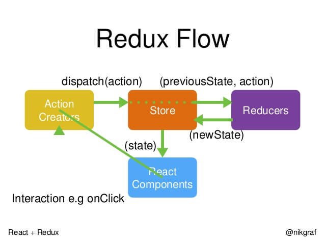

# redux知识点整理
不适用于小白
## 设计思想
（1）Web 应用是一个状态机，视图与状态是一一对应的。
（2）所有的状态，保存在一个对象里面。

## 核心概念
1. Store
     Store 就是保存数据的地方，你可以把它看成一个容器。整个应用只能有一个 Store。
2. reducer
     纯函数用来修改Store中存储的数据值。注意reducer中传入的state值是不可修改的
     实际项目中reducer可以通过combineReducers拆分
3. action
     行为，用来触发reducer，action分为两个参数 一个type 一个payload。payload必须是普通对象

## 整体流程

首先，用户发出 Action。

```javascript
 store.dispatch(action);

```

然后，Store 自动调用 Reducer，并且传入两个参数：当前 State 和收到的 Action。 Reducer 会返回新的 State 。

```javascript
 let nextState = todoApp(previousState, action);

```

State 一旦有变化，Store 就会调用监听函数。(新版reducer已经用不到监听了)

```javascript
// 设置监听函数
store.subscribe(listener);

```

`listener`可以通过`store.getState()`得到当前状态。如果使用的是 React，这时可以触发重新渲染 View。

```javascript 
    function listerner() {
     let newState = store.getState();
     component.setState(newState);   
    }
```

## 如何使用中间件

```javascript
const store = createStore(
  reducer,
  applyMiddleware(promise,logger) // 中间件引入的先后顺序
);
```

## 异步操作
首先各种异步中间件原理都大体相同，即使用redux中间件函数，统一拦截发出得dispatch。不同异步中间做了不同处理
### redux-promise
```
import isPromise from 'is-promise'; 
import { isFSA } from 'flux-standard-action'; 
  
export default function promiseMiddleware({ dispatch }) { 
  return next => action => { 
    if (!isFSA(action)) { 
      return isPromise(action) ? action.then(dispatch) : next(action); 
    } 
    
   return isPromise(action.payload) 
    ? action.payload 
    .then(result => dispatch({ ...action, payload: result })) 
     .catch(error => { 
       dispatch({ ...action, payload: error, error: true }); 
       return Promise.reject(error); 
     }) 
     : next(action); 
   }; 
 } 
```
这个中间件使得`store.dispatch`方法可以接受 Promise 对象作为参数。如果接到得是promise对象则根据promise对象得执行结果去触发action
### redux-thunk
```
function createThunkMiddleware(extraArgument)
 { 
   return  ({ dispatch, getState }) => next => action => { 
     if (typeof action === 'function') { 
       return action(dispatch, getState, extraArgument); 
     } 
     return next(action); 
   }; 
 } 
 const thunk = createThunkMiddleware(); 
 thunk.withExtraArgument = createThunkMiddleware; 
 export  default thunk;
```
判断action的参数是不是一个函数，如果是函数则将action的参数
### redux-sega 
通过generator处理异步，更细致的颗粒度
### 三种方法差异
redux-promise 写发简单。redux-thunk模板代码太多 redux-saga复杂但是颗粒度比较细
## react-redux

## redux-actions

## 实现原理


参考文章
[阮一峰redux系列](http://www.ruanyifeng.com/blog/2016/09/redux_tutorial_part_one_basic_usages.html)

