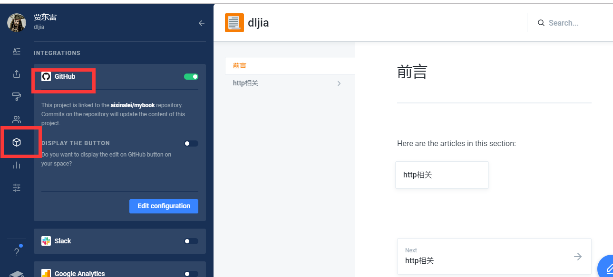
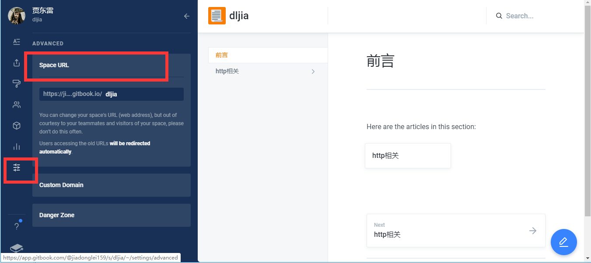

# gitbook简易配置教程

1. 再github上建一个仓库
2. 登录[gitbook官网](https://app.gitbook.com/)
3. 创建一个新工作区

4. 配置github仓库地址

5. 查看访问域名

6. 测试
	1. clone github 仓库地址到本地
	  初始会有两个md文件，分别是 SUMMARY.md及README.md，他们的作用如下：
		  *  README.md—— 书籍的介绍写在这个文件里
		  *  SUMMARY.md —— 书籍的目录结构在这里配置
		```
		样例结构：
		* [Introduction](README.md)
		* [基本安装](howtouse/README.md)
		   * [Node.js安装](howtouse/nodejsinstall.md)
		   * [Gitbook安装](howtouse/gitbookinstall.md)
		   * [Gitbook命令行速览](howtouse/gitbookcli.md)
		* [图书项目结构](book/README.md)
		   * [README.md 与 SUMMARY编写](book/file.md)
		   * [目录初始化](book/prjinit.md)
		* [图书输出](output/README.md)
		   * [输出为静态网站](output/outfile.md)
		   * [输出PDF](output/pdfandebook.md)
		* [发布](publish/README.md)
		   * [发布到Github Pages](publish/gitpages.md)
		* [结束](end/README.md)
		```
	2. 添加新文件提交到github
    


## 参考文献：
[Gitbook 使用入门](https://tonydeng.github.io/gitbook-zh/gitbook-howtouse/)
